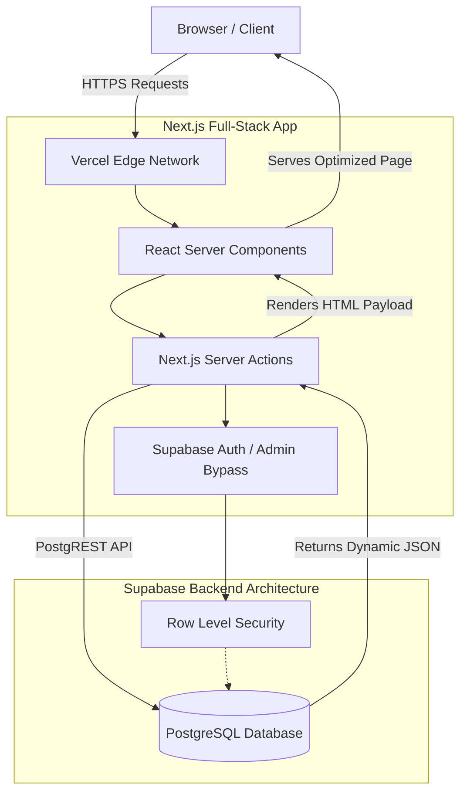
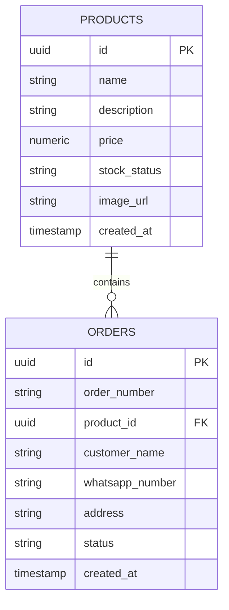
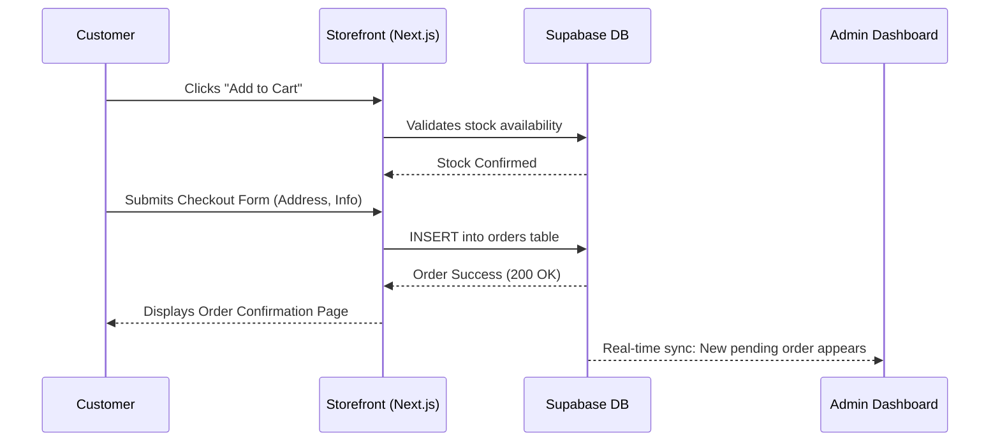
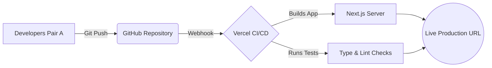
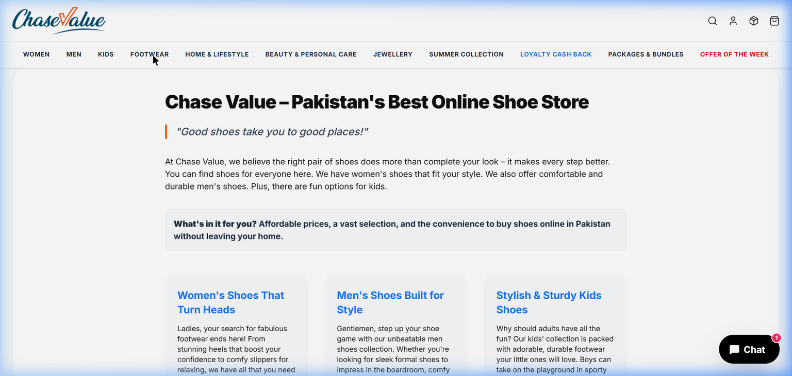
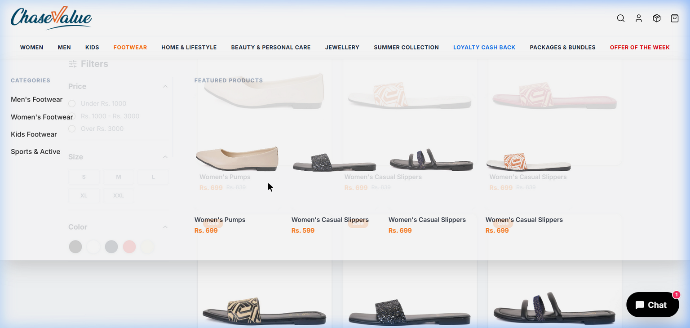
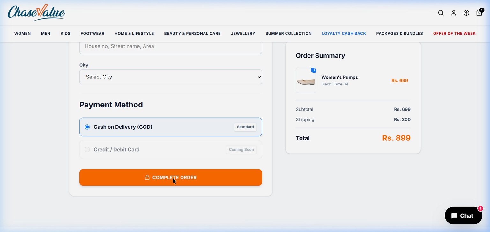
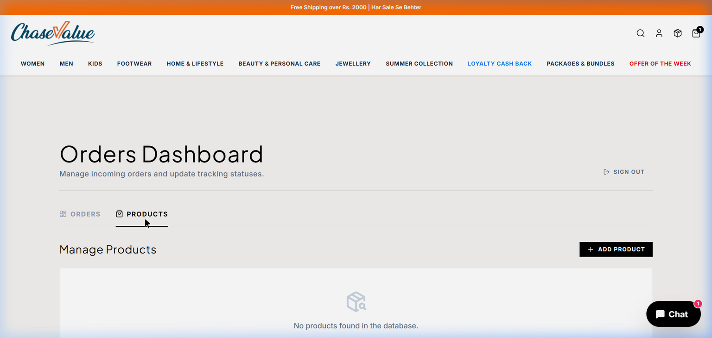
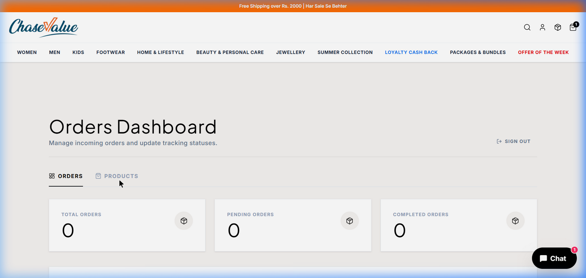

# Chase Value E-Commerce Migration: Week 2 Sprint Report

**Team:** Pair A (Usman Ibrahim, Alishba Inam)  
**Project:** Chase Value Storefront & Admin Dashboard Platform  
**Status:** Week 2 Completed  

### Project Links
- **Live Production Application:** [https://chasevalue.vercel.app/](https://chasevalue.vercel.app/)
- **Source Code Repository:** [GitHub - ChaseValue Website](https://github.com/SKILLITx/WebDevProjects/tree/main/ChaseValue%20Website)

---

## 1. Executive Summary

This week, our engineering pair successfully executed the core objective of the sprint: migrating the initial static HTML/JSON prototype of the Chase Value e-commerce platform into a highly dynamic, production-ready full-stack application. We architected a robust backend using Supabase (PostgreSQL), developed a secure Admin Portal for real-time inventory and order management, and established a seamless automated deployment pipeline via Vercel. 

By replacing hardcoded data with a live, synchronized database, we have laid the absolute foundation required to scale the business, handle real-time customer purchases, and allow administrators to manage stock without needing a developer to touch the code.

---

## 2. Technology Stack & Architecture Design

We modernized the entire technology stack to ensure enterprise-grade high performance, security, and scalability:

- **Frontend Framework:** Next.js 16 (App Router) / React 19. Chosen for its Server-Side Rendering (SSR) capabilities which vastly improves SEO and Time-to-First-Byte (TTFB).
- **Styling Engine:** Tailwind CSS. Utilized for utility-first responsive design.
- **Database & Authentication:** Supabase. We utilized a scalable PostgreSQL relational database protected by built-in Row Level Security (RLS) policies.
- **State Management:** React Context API. Used to maintain the global state of the customer's shopping cart.
- **Animations:** Framer Motion. Implemented for micro-interactions and smooth UI transitions.
- **Deployment & CI/CD:** Vercel Edge Network. Leveraged for ultra-fast global content delivery.

### 2.1 Core System Architecture

### 2.2 Database Entity-Relationship (ER) Diagram

---

## 3. Detailed Work Breakdown & Hours Logged

**Total Hours Logged (Pair A): 60 Hours**
*(Average 30 hours per team member over the sprint)*

### Phase 1: Frontend Migration & Component Architecture (10 Hours)
- **Work Performed:** Completely dismantled the monolithic, legacy static HTML files and rebuilt them into a modular, component-based Next.js App Router application.
- **Technical Implementation:**
  - Separated UI elements into reusable React components (`Navbar.tsx`, `Footer.tsx`, `ProductCard.tsx`).
  - Implemented Next.js dynamic routing (`/collections/[slug]`, `/products/[id]`), generating pages on-the-fly based on the URL parameter.
  - Integrated the `next/image` component to automatically serve WebP images and prevent Cumulative Layout Shift (CLS). Whitelisted external CDNs (`cdn.shopify.com`, `chasevalue.pk`) to ensure images load instantly.

### Phase 2: Database Schema Design & Backend Integration (15 Hours)
- **Work Performed:** Designed and integrated a centralized PostgreSQL database using Supabase, deprecating the local `chase_products.json` fallback mechanism.
- **Technical Implementation:**
  - Designed normalized SQL schemas for the `products` and `orders` tables.
  - Engineered a custom Node.js programmatic seeder script (`seed_supabase.ts`) that parsed the legacy JSON file and batch-inserted all 54 active products directly into the live production database.

### Phase 3: Secure Admin Portal Development (20 Hours)
- **Work Performed:** Built a comprehensive, secure Admin Dashboard.
- **Technical Implementation:** 
  - **Full CRUD Operations:** Developed Next.js Server Actions to securely handle creating, reading, updating, and deleting products entirely on the server side.
  - **Inline Stock Management:** Built an intuitive stock management UI. Changes sync instantly with PostgreSQL and update the public storefront (e.g., dropping stock to 0 triggers an "Out of Stock" badge).
  - **Security & Authorization:** Established strict Row Level Security (RLS) policies in PostgreSQL, protecting `/admin` routes.

### Phase 4: Global Cart State & Checkout Engineering (8 Hours)
- **Work Performed:** Integrated the global Cart Context with the live database.
- **Technical Implementation:** 
  - Refactored the "Add To Cart" logic to validate against live Supabase inventory, preventing race conditions.
  - Engineered the checkout form to construct a transactional payload and insert it directly into the `orders` table.

#### 4.1 Customer Checkout Workflow

### Phase 5: CI/CD Deployment, Optimization & QA Auditing (7 Hours)
- **Work Performed:** Established continuous integration to Vercel and resolved critical production-blocking deployment bugs.
- **Technical Implementation:** 
  - Resolved a Next.js Turbopack JSX parsing error.
  - Diagnosed a critical Supabase connection failure by writing a custom sanitization wrapper in `client.ts` to automatically strip invalid `/rest/v1/` paths injected by Vercel's environment variables. 
  - Conducted extensive end-to-end QA tests on the live site.

#### 5.1 CI/CD Automated Deployment Pipeline

---

## 4. Visual Evidence & Showcase

*(Note: The following images reflect the live production build and the actual integrated dashboard.)*

### Storefront & Product Grid Operations

*The highly optimized, responsive storefront dynamically rendering products directly from the Supabase PostgreSQL database.*

*Category filtering and dynamic product routing in action. Prices and stock labels are injected in real-time.*

### Cart & Secure Checkout

*The seamless checkout interface that securely transmits customer data to the backend via Server Actions.*

### Administrative Control Portal

*The secure administrative portal for managing inventory. Notice the "Update Stock" inline editing functionality.*

*Centralized order tracking dashboard showing total, pending, and completed orders synced instantly from the live checkout flow.*

---
*Report compiled, documented, and officially submitted by Pair A (Usman Ibrahim & Alishba Inam).*
