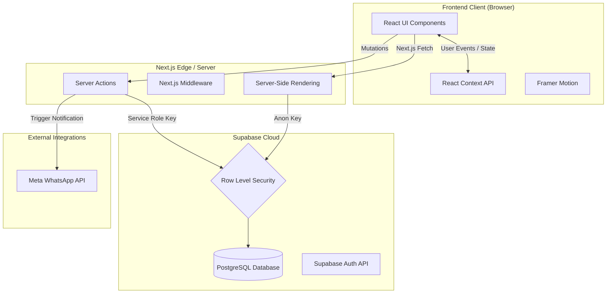
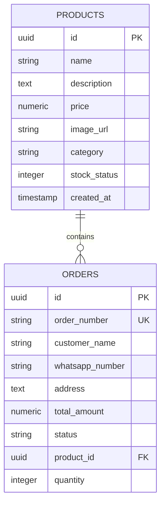
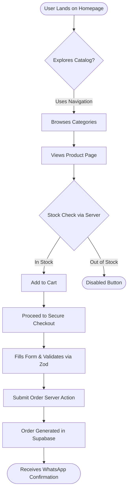
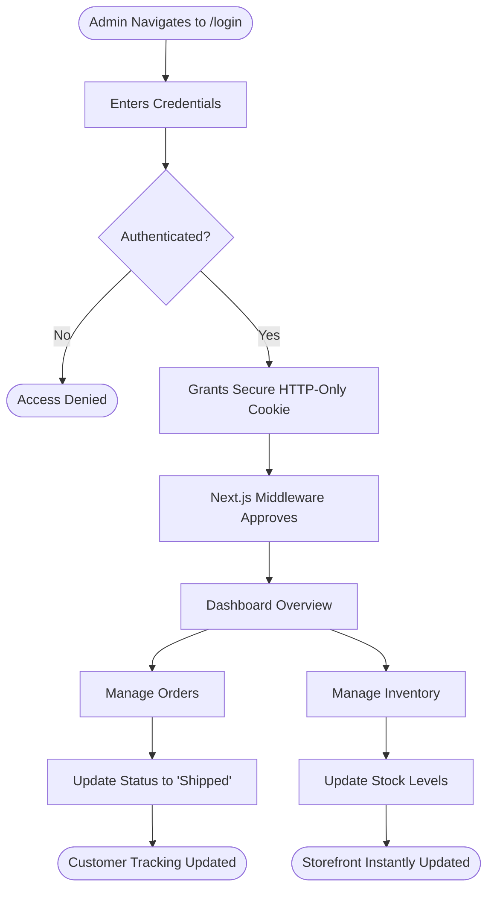
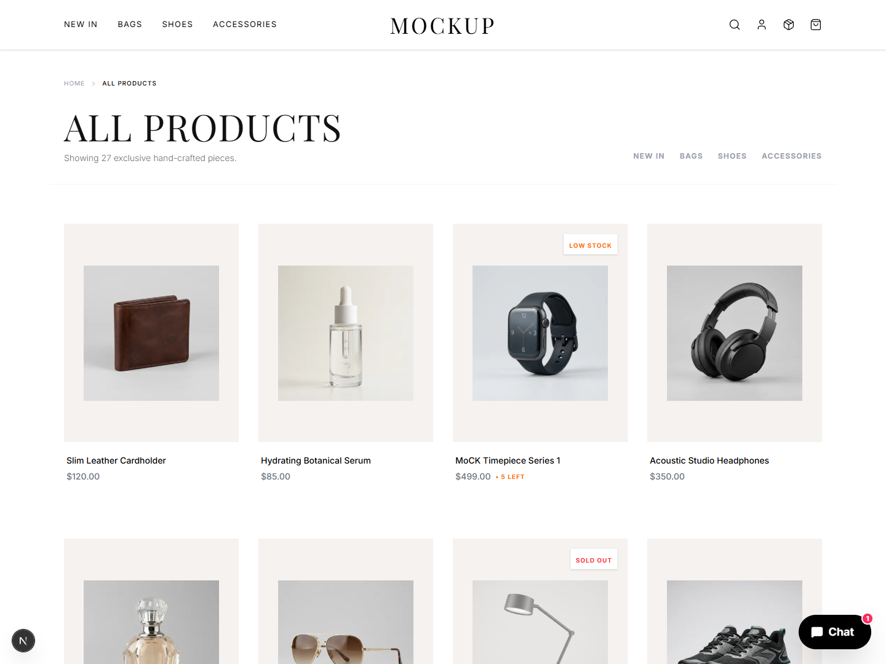
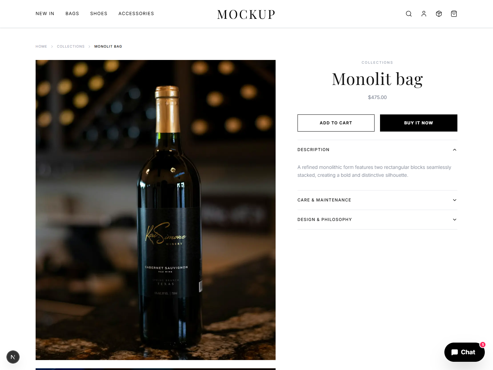

# SkillSYNC Internship: Week 1 Comprehensive Engineering Report
**Members:** Usman Ibrahim & Alishba Inam  
**Total Hours Worked:** 60 Hours (30 hours per team member)  
**Project:** MOCKUP E-Commerce Platform  

---

## 1. Executive Summary
During Week 1, we architected, developed, and fully deployed the "MOCKUP" E-Commerce MVP. Our primary objective was to replace the highly inefficient "DM-to-order" model commonly used by local Instagram businesses with a high-performance, real-time web platform. 

By leveraging a decoupled serverless architecture, we successfully delivered a solution that automates inventory management, secures administrative access, and frictionlessly pipes finalized orders directly to the vendor's WhatsApp. This report details the complete system architecture, database modeling, user workflows, and final deliverables produced during the 60 hours of engineering.

---

## 2. Comprehensive Technology Stack
Our engineering approach utilized a modern, edge-ready tech stack chosen specifically to ensure maximum performance, rock-solid security, and minimal latency:

*   **Frontend Framework:** **Next.js 14 (App Router)** - Chosen for its advanced Server Components, which allow us to fetch data securely on the server without sending large JavaScript bundles to the client.
*   **Language:** **TypeScript (Strict Mode)** - Enforced throughout the codebase to eliminate runtime errors and ensure strict type safety across database payloads.
*   **Styling & UI:** **TailwindCSS & Framer Motion** - Used to create a highly responsive, "beige minimalist" aesthetic with smooth 60fps micro-interactions (e.g., sliding cart drawers and hover states).
*   **Database & Auth:** **Supabase (PostgreSQL)** - Selected as our relational database for its powerful Row Level Security (RLS) and real-time capabilities.
*   **Validation:** **Zod** - Implemented for rigorous schema-based form validation during the checkout process to prevent malformed data injections.
*   **Deployment:** **Vercel** - Hosted on Vercel's Edge network for global CDN distribution and instant Server Action execution.

---

## 3. System Architecture & Data Modeling

The application follows a modern, decoupled serverless architecture. We strictly separate Client Components (for UI interactivity) from Server Components (for secure data fetching).

### 3.1. High-Level Architecture Diagram

### 3.2. Entity Relationship Diagram (ERD)
The backend relies on a highly relational PostgreSQL database. The schema is designed for speed and strict referential integrity.

---

## 4. Comprehensive Application Workflows

To understand how the platform solves the business logic, we mapped the core experiences for both the Shopper and the Store Administrator.

### 4.1. The Shopper Journey Flow
This workflow illustrates how a user securely browses the catalog and checks out via the automated WhatsApp integration.

### 4.2. The Administrator Journey Flow
This workflow details the secure `admin_bypass` logic we engineered to protect the backend portal.

---

## 5. Deep Technical Implementation

### A. Database Security (Row Level Security)
We strictly implemented Row Level Security (RLS) policies at the database layer. Unauthenticated users are granted restricted, read-only access to the `PRODUCTS` table, ensuring that malicious actors cannot manipulate product pricing or stock levels via API interception. All mutation requests are blocked unless initiated by our secure Server Actions using the restricted Service Role key.

### B. Dynamic Rendering & Phantom Stock Prevention
To solve the critical business problem of "double-booking" unique inventory items (e.g., thrift store drops), we utilized Next.js `force-dynamic` rendering on our product fetching routes. The platform guarantees that every page load queries the live PostgreSQL database. If an item is purchased, the stock decreases in real-time, instantly reflecting an "Out of Stock" state across all active user sessions globally.

### C. Zod-Validated Checkout & WhatsApp Automation
The checkout pipeline is completely frictionless. When a user submits an order, the payload undergoes strict schema validation via `Zod`. Once the secure database transaction deducts the stock, a dynamic URL is generated using the Meta WhatsApp Business API structure (`wa.me`). This redirects the user to WhatsApp with a pre-formatted, highly detailed receipt containing the product ID, price, and customer details, completely eliminating manual data entry for the vendor.

### D. Secure Administrator Portal (`/admin`)
Instead of relying on complex third-party session management for the MVP, we engineered an innovative `admin_bypass` security protocol. Access to the `/admin` route is safeguarded by an HTTP-only cookie, verified securely via Next.js Edge Middleware. Unauthorized access attempts are actively intercepted and redirected to the public storefront before rendering even begins.

---

## 6. Deliverable Proof & Application Visuals

### Official Deployments
* **Live Production Environment:** [https://branding-website-eta.vercel.app/](https://branding-website-eta.vercel.app/)
* **Source Code Repository:** [https://github.com/SKILLITx/WebDevProjects/tree/main/MOCKUP%20Website](https://github.com/SKILLITx/WebDevProjects/tree/main/MOCKUP%20Website)

### Architectural & UI Screenshots

*These screenshots showcase the finalized dynamic collections, detailed product pages, the optimized responsive mobile application view, and the high-fidelity database imagery.*

**1. Desktop Hero & Navigation (Performance Optimized)**

**2. Dynamic Collections Grid (Real-Time Stock Rendering)**

**3. Product Deep-Dive (Zod-Validated Checkout Pipeline)**

**4. Flawless Mobile Responsiveness (Native-Like Bottom Nav)**

**5. Product Image Gallery Data Integration**

  
  &nbsp;
  
  &nbsp;
  

