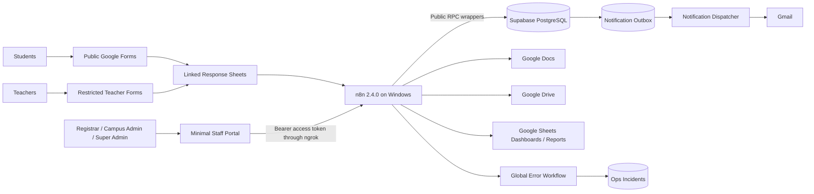
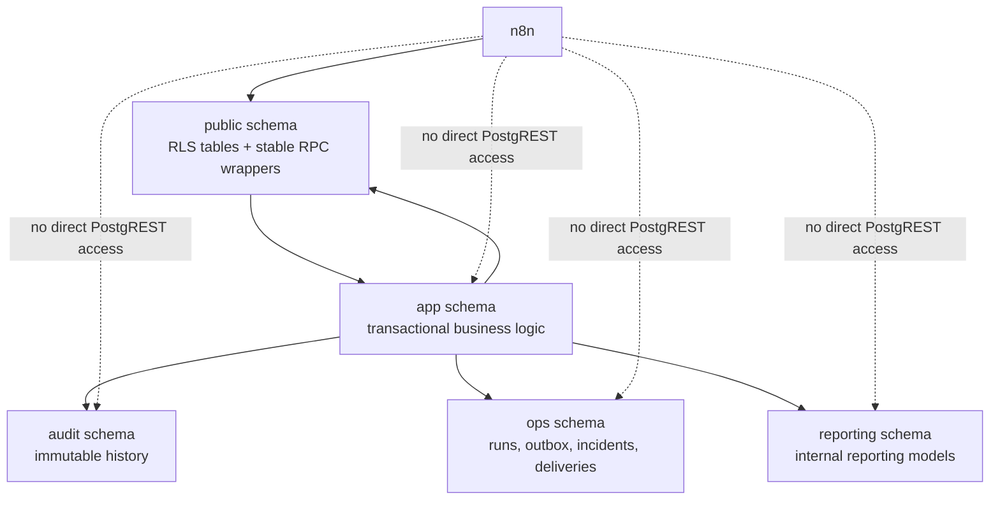
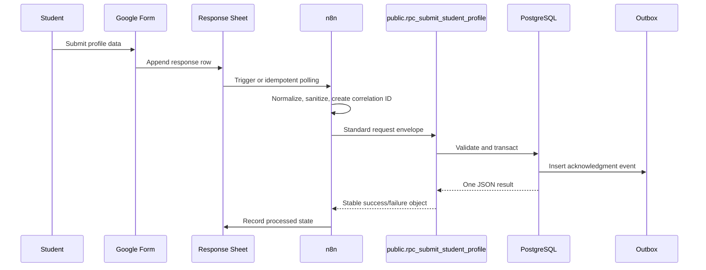
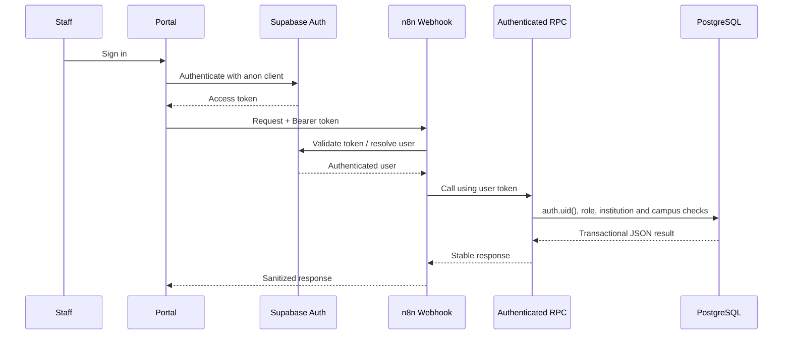
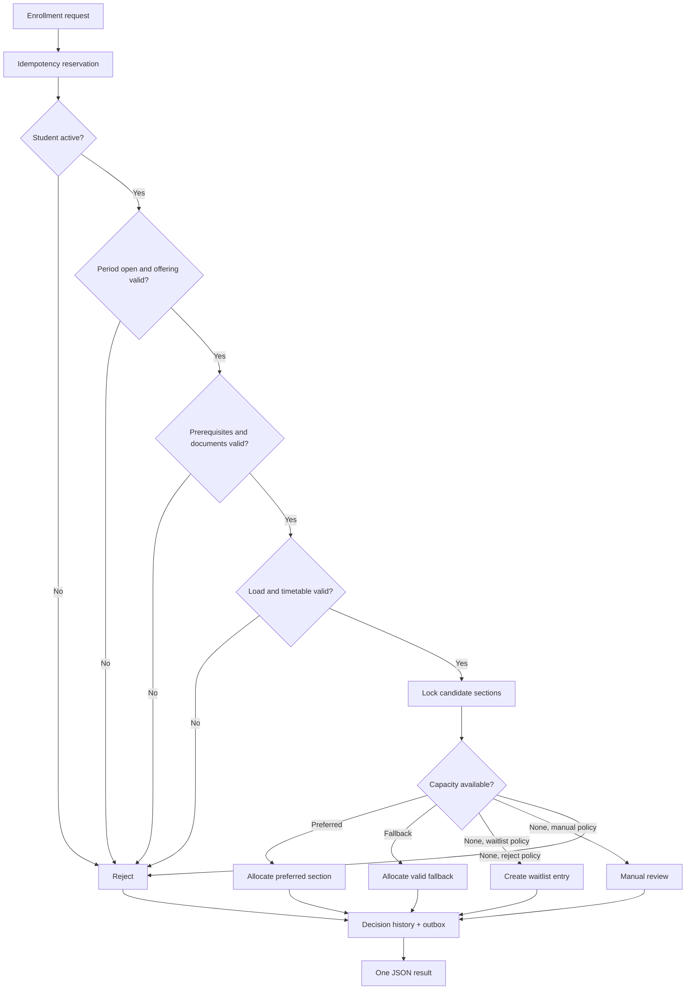
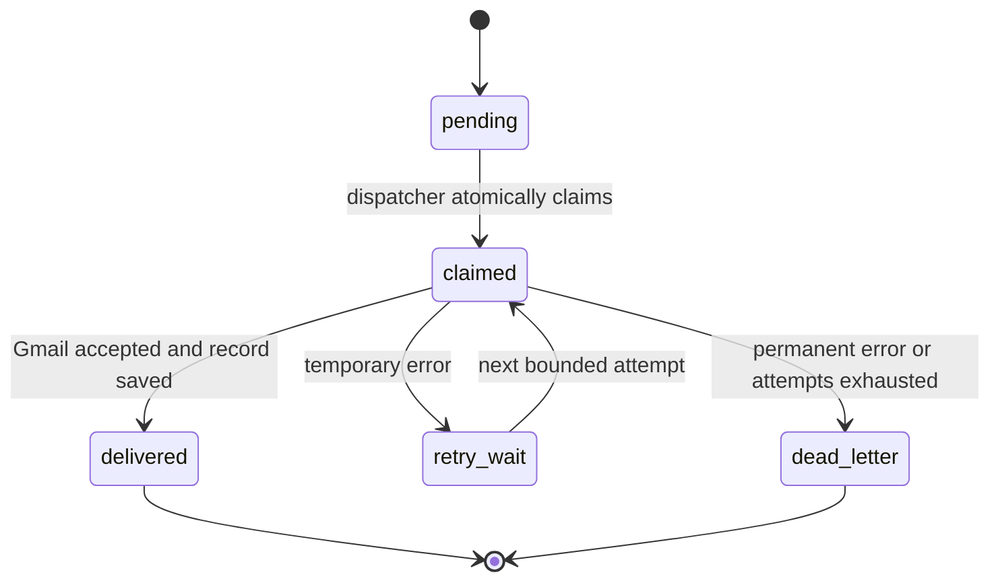
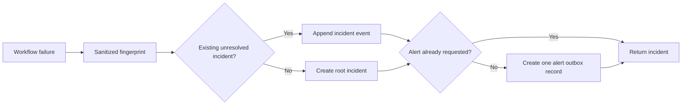

# Data-Flow Diagrams

The diagrams use Mermaid syntax and can be rendered by GitHub, Mermaid Live Editor or compatible Markdown tools.

## 1. System context

## 2. Database schema separation

## 3. Public student intake

## 4. Authenticated staff operation

## 5. Enrollment transaction

## 6. Results and transcript flow

```mermaid
flowchart LR
    M[Teacher marks batch] --> V[Validate and finalize]
    V --> AP[Registrar approval]
    AP --> CALC[PostgreSQL grade/GPA calculation]
    CALC --> PUB[Publish results]
    PUB --> TR[Transcript request]
    TR --> MODEL[Complete transcript model]
    MODEL --> DOC[Google Docs template]
    DOC --> PDF[PDF export]
    PDF --> DRIVE[Drive storage]
    DRIVE --> OUT[Delivery outbox / record]
    OUT --> MAIL[Gmail]
```

## 7. Notification outbox

## 8. Incident handling

