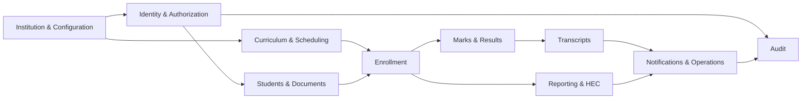

# Phase 2 Entity-Relationship Diagrams

The overview shows the domain flow. The detailed Mermaid source contains every detected foreign-key relationship from the Phase 2 migrations.

Detailed source: `database/schema/phase2-erd.mmd`.
